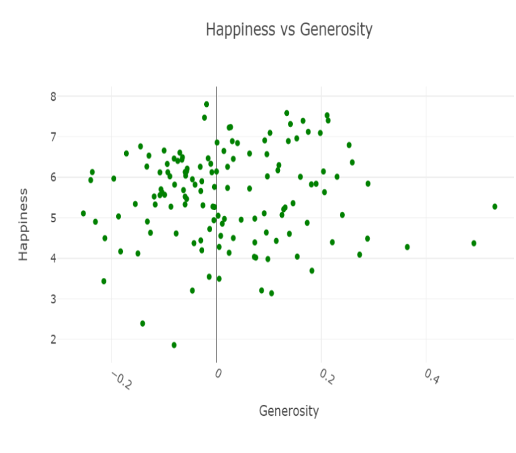
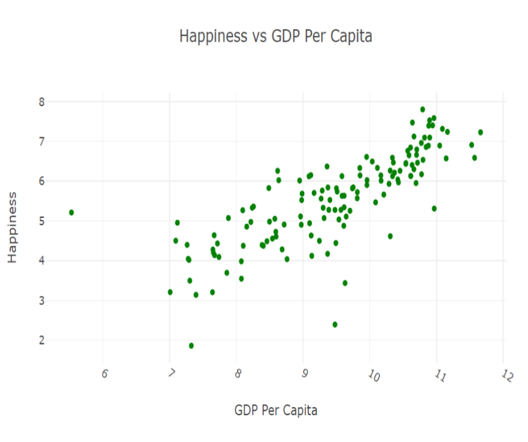
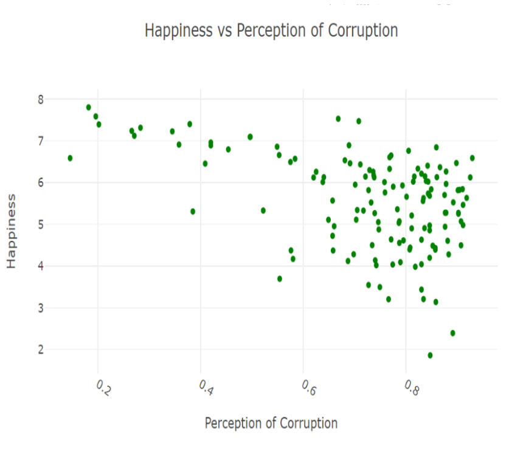

# Project Happiness

## Project Description/Outline:

Using information from the 2023 World Happiness Report, we created several data visualizations in order to delve into each country's happiness score.  In addition to allowing users to investigate the details of each country's happiness score, it also allows the user to examine the relationship between all of the included countries' happiness scores and the following variables from each country:

- Per Capita GDP
- Social Support
- Healthy Life Expectancy
- Freedom to Make Life Choices
- Generosity
- Perception of Corruption

Analysis of these relationships can be found in the "Visualizations & Analysis" section of this file.

## Repository Contents:

- Output folder containing:
  -  Zip File of Original Datasets
  -  Json File Containing the Data
  -  Excel File Explaining the Utilized Variables
  -  Sample Schema Used to Create Database in PostgreSQL
  -  CSV File of Cleaned Dataset
- Static folder containing the following files (which created and styled the some of the various charts & plots): 
  - app_scatter.js
  - choropleth.js
  - countrydata.geojson
  - styles.css
- HTML files:
  - index.html
  - choropleth.html
  - sunburst.html
- Flask app (flasky.py) 
- Jupyter notebook (plots.ipynb) creating the choropleth & sunburst visuals)

## Notes & Resources:

Dataset Used: https://www.kaggle.com/datasets/ajaypalsinghlo/world-happiness-report-2023

## Visualizations & Analysis:
Four types of visualizations were created.
1. Choropleth map (shown above)
  a. Provides an overview of which countries are the happiest and least happy based on each country's respective color
2. Bar Graphs Displaying The Countries with the 10 Highest and the 10 Lowest Happiness Scores (top 10 shown below)
  
3. Sunburst Allowing Users to Focus on Happiness Levels within Specific Regions
  
4. Scatter Plots Displaying the Correlation Between Each Analyzed Variable & Hapiness Score

## General Analysis
First, to speak generally about the happiest and least happy locations according to the 2023 World Happiness Report:  If we look at the world as being split into 5 regions (Europe, Asia, the Americas, Africa, and Oceania), the happiest overall region is Oceania (which is also the smallest region – only including Australia and New Zealand), while the lowest happiness scores can be found in the region of Africa.  This is evident in both the choropleth map and the sunburst visual provided previously within this file.  

With that being said, even though the happiest overall region is Oceania, the happiest three countries (Finland, Denmark, and Iceland) are all in Europe, specifically Northern Europe.  All three of these countries have some of the highest perceptions of freedom, higher than average GDPs (although not the highest), above average healthy life expectancies and fall within the highest 5 countries in terms of social support.  

As was supported by the sunburst diagram and the choropleth map, 8 of the 10 countries with the lowest happiness scores were in Africa (although the lowest two – Afghanistan and Lebanon are both in Asia).  Afghanistan, which had the lowest happiness score (1.859), fell in the lowest range for social support, health life expectancy, GDP, and had the lowest perception of freedom of each country represented.  
## A Look at Each Variable’s Relationship with Happiness Score
### Generosity: Weak/No Association

The association between happiness scores and generosity levels in the various countries was extremely weak.  It appears that a linear regression analysis would produce a line with a slope of zero and high residual values due to the points not being closely clustered around the line.  Generosity does not appear to be a good predictor of the happiness score of a country.
### Perception of Freedom, GDP, Healthy Life Expectancy, Social Support: Positive Associations

The association between each of the above-mentioned variables and happiness scores are roughly linear, moderately strong, and positive.  As each of these variables increased, happiness scores tend to increase as well.  These relationships are fairly similar in strength, but the correlation between GDP and happiness appears to be the strongest of the four (further analysis and investigation of correlation coefficients and coefficients of determination would provide confirmation).
### Perception of Corruption: Negative Association

As corruption levels increase, happiness scores of countries tended to decrease.  This association was strong and linear for countries with lower corruption levels.  As corruption levels increased, the association weakened; in other words, countries with less corruption tend to have high happiness levels, but when corruption levels are higher happiness scores vary greatly.

_

## Team: 
- Natalie Lollin
- Anthony Pino
- Chad Richards
- Riddhi Sodagar

## Link to Presentation:
https://docs.google.com/presentation/d/1rHS5Z6X_h9FFZaTOMpYX8JeUxP1HxD3Rap36ZVbSfcg/edit?usp=sharing
_
