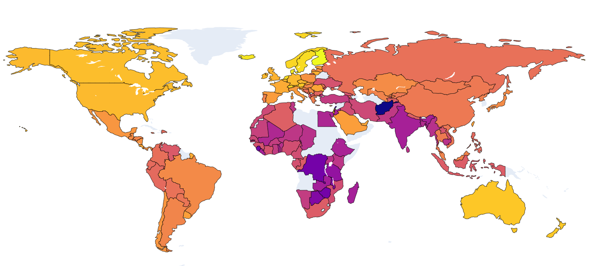
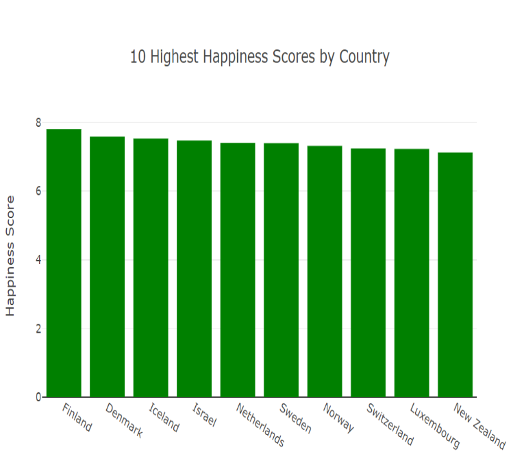
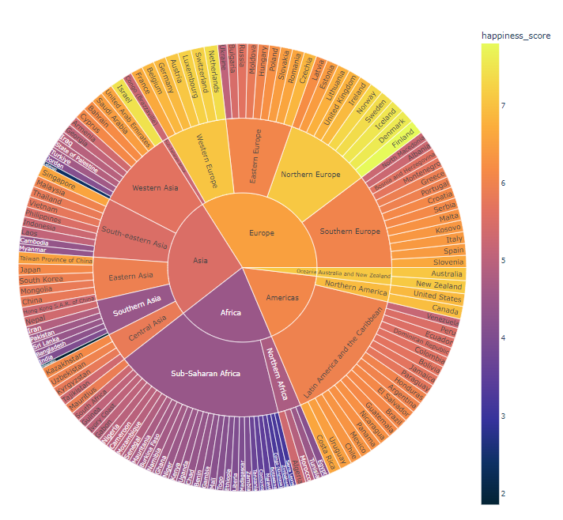

# Project Happiness

## Project Description/Outline:

Using information from the 2023 World Happiness Report, we created several data visualizations in order to delve into each country's happiness score.  In addition to allowing users to investigate the details of each country's happiness score, it also allows the user to examine the relationship between all of the included countries' happiness scores and the following variables from each country:

- Per Capita GDP
- Social Support
- Healthy Life Expectancy
- Freedom to Make Life Choices
- Generosity
- Perception of Corruption

Analysis of these relationships can be found in the "Visualizations & Analysis" section of this file.

## Repository Contents:

- Output folder containing:
  -  Zip File of Original Datasets
  -  Json File Containing the Data
  -  Excel File Explaining the Utilized Variables
  -  Sample Schema Used to Create Database in pgAdmin
  -  CSV File of Cleaned Dataset
- Static folder containing the following files (which created and styled the some of the various charts & plots): 
  - app_scatter.js
  - choropleth.js
  - countrydata.geojson
  - styles.css
- HTML files:
  - index.html
  - choropleth.html
  - sunburst.html
- Flask app (flasky.py) 
- Jupyter notebook (plots.ipynb) creating the choropleth & sunburst visuals)

## Notes & Resources:

Dataset Used: https://www.kaggle.com/datasets/ajaypalsinghlo/world-happiness-report-2023

## Visualizations & Analysis:
Four types of visualizations were created.
1. Choropleth map (shown above)
  a. Provides an overview of which countries are the happiest and least happy based on each country's respective color
2. Bar Graphs Displaying The Countries with the 10 Highest and the 10 Lowest Happiness Scores (top 10 shown below)
  
3. Sunburst Allowing Users to Focus on Happiness Levels within Specific Regions
  
4. Scatter Plots Displaying the Correlation Between Each Analyzed Variable & Hapiness Score

_

## Team: 
- Natalie Lollin
- Anthony Pino
- Chad Richards
- Riddhi Sodagar

## Link to Presentation:

_
